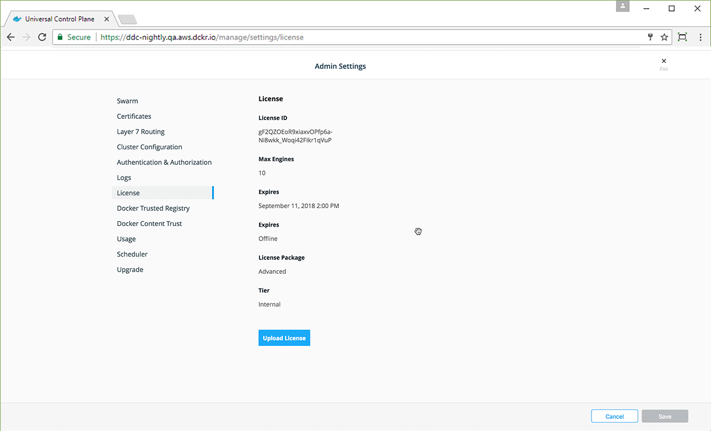
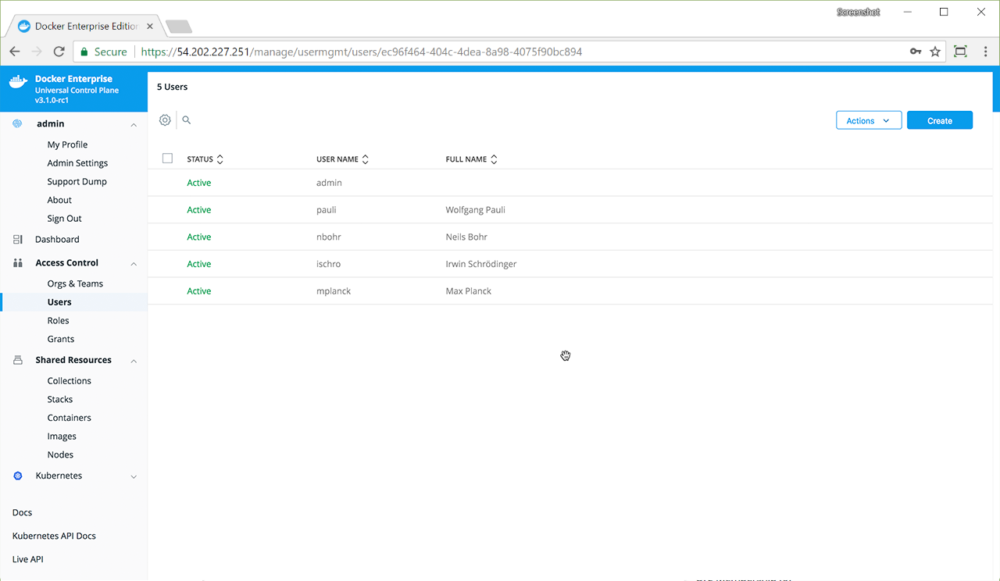

# Docker Universal Control Plane

[Back](./ReadMe.md)

 [Reference](https://docs.docker.com/ee/ucp/)


Docker EE is a software subscription that includes three products:

* Docker Engine with enterprise-grade support
* Docker Trusted Registry
* Docker Universal Control Plane

Docker Universal Control Plane (UCP) is the enterprise-grade cluster management solution from Docker. You install it on-premises or in your virtual private cloud, and it helps you manage your Docker cluster and applications through a single interface.

 You can manage and monitor your container cluster using a graphical UI.

 With Docker UCP, you can manage from a centralized place all of the computing resources you have available, like nodes, volumes, and networks.

You can also deploy and monitor your applications and services.

 

## Installation
`
### Pull the latest version of UCP
```
docker image pull docker/ucp:3.1.7
```

#### Install UCP

1. Use ssh to log in to the host where you want to install UCP.

2. Run the following:

#### Pull the latest version of UCP
```
docker image pull docker/ucp:3.1.7
```

#### Install UCP
```
docker container run --rm -it --name ucp \
  -v /var/run/docker.sock:/var/run/docker.sock \
  docker/ucp:3.1.7 install \
  --host-address <node-ip-address> \
  --interactive
  ```

This runs the install command in interactive mode, so that you’re prompted for any necessary configuration values. 

UCP will install [Project Calico](https://docs.projectcalico.org/v3.7/introduction/) for container-to-container communication for Kubernetes. A platform operator may choose to install an alternative CNI plugin, such as Weave or Flannel.

3. License your installation

Now that UCP is installed, you need to license it. To use UCP you are required to have a Docker EE standard or advanced subscription, or you can test the platform with a free trial license.

3.1 Go to [Docker Hub](https://hub.docker.com/editions/enterprise/docker-ee-trial/trial) to get a free trial license.
3.2 In your browser, navigate to the UCP web UI, log in with your administrator credentials and upload your license. Navigate to the Admin Settings page and in the left pane, click License.
3.3 Click Upload License and navigate to your license (.lic) file. When you’re finished selecting the license, UCP updates with the new settings.



## Built-in security and access control
Docker UCP has its own built-in authentication mechanism and integrates with LDAP services. It also has role-based access control (RBAC), so that you can control who can access and make changes to your cluster and applications.



Docker UCP integrates with Docker Trusted Registry so that you can keep the Docker images you use for your applications behind your firewall, where they are safe and can’t be tampered with.

You can also enforce security policies and only allow running applications that use Docker images you know and trust.

## Install UCP for production
Docker Universal Control Plane (UCP) is a containerized application that you can install on-premise or on a cloud infrastructure.

### [System Requirements](https://docs.docker.com/ee/ucp/admin/install/system-requirements/)

Common Requirements:
* Docker EE Engine version 18.09
* Linux kernel version 3.10 or higher
* A static IP address for each node in the cluster

Minimum requirements
* 8GB of RAM for manager nodes
* 4GB of RAM for worker nodes
* 2 vCPUs for manager nodes
* 5GB of free disk space for the /var partition for manager nodes (A minimum of 6GB is recommended.)
* 500MB of free disk space for the /var partition for worker nodes

Recommended production requirements
* 16GB of RAM for manager nodes
* 4 vCPUs for manager nodes
* 25-100GB of free disk space

### Ports used
When installing UCP on a host, a series of ports need to be opened to incoming traffic. Each of these ports will expect incoming traffic from a set of hosts, indicated as the “Scope” of that port. The three scopes are:

* External: Traffic arrives from outside the cluster through end-user interaction.
* Internal: Traffic arrives from other hosts in the same cluster.
* Self: Traffic arrives to that port only from processes on the same host.

Make sure the following ports are open for incoming traffic on the respective host types:

| osts | Port | Scope | Purpose |
| --- | --- | --- | --- |
| managers, workers | TCP 179 | Internal | Port for BGP peers, used for kubernetes networking |
| managers | TCP 443 (configurable) | External, Internal | Port for the UCP web UI and API |
| managers | TCP 2376 (configurable) | Internal | Port for the Docker Swarm manager. Used for backwards compatibility |
| managers | TCP 2377 (configurable) | Internal, | Port for control communication between swarm nodes |
| managers, workers | UDP 4789 | Internal, | Port for overlay networking |
| managers | TCP 6443 (configurable) | External, Internal | Port for Kubernetes API server endpoint |
| managers, workers | TCP 6444 | Self | Port for Kubernetes API reverse proxy |
| managers, workers | TCP, UDP 7946 | Internal | Port for gossip-based clustering |
| managers, workers | TCP 9099 | Self | Port for calico health check |
| managers, workers | TCP 10250 | Internal | Port for Kubelet |
| managers, workers | TCP 12376 | Internal | Port for a TLS authentication proxy that provides access to the Docker Engine |
| managers, workers | TCP 12378 | Self | Port for Etcd reverse proxy |
| managers | TCP 12379 | Internal | Port for Etcd Control API |
| managers | TCP 12380 | Internal | Port for Etcd Peer API |
| managers | TCP 12381 | Internal | Port for the UCP cluster certificate authority |
| managers | TCP 12382 | Internal | Port for the UCP client certificate authority |
| managers | TCP 12383 | Internal | Port for the authentication storage backend |
| managers | TCP 12384 | Internal | Port for the authentication storage backend for replication across managers |
| managers | TCP 12385 | Internal | Port for the authentication service API |
| managers | TCP 12386 | Internal | Port for the authentication worker |
| managers | TCP 12388 | Internal | Internal Port for the Kubernetes API Server |

